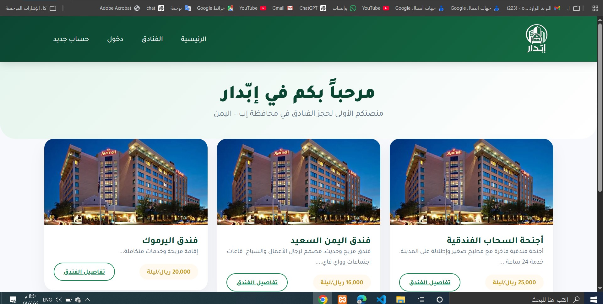
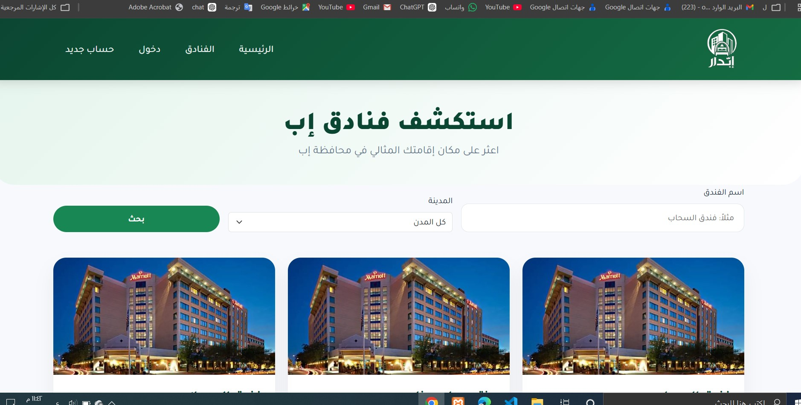
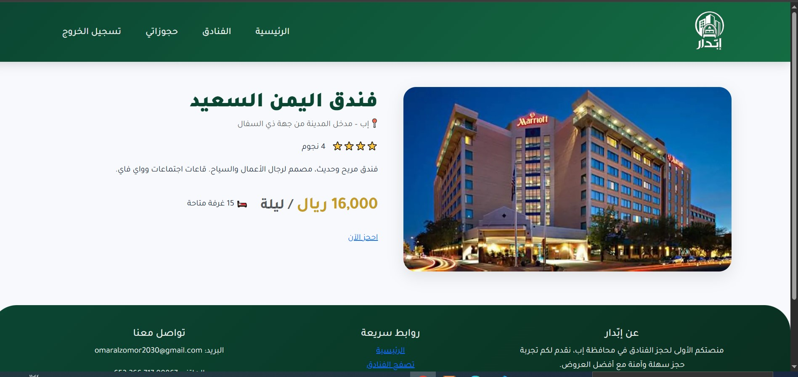
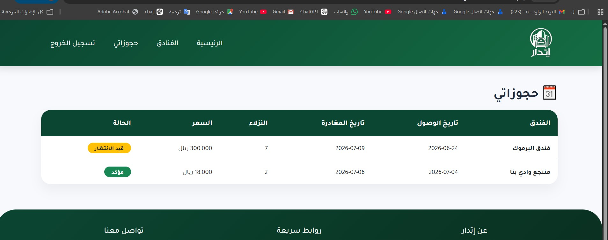
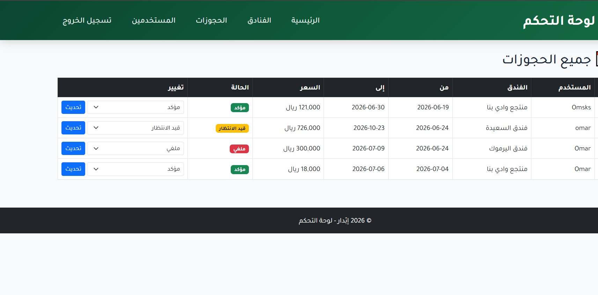

#  إبّدار – منصة حجز فنادق محافظة إب

<div align="center">
  
  <br><br>
  <p><strong>منصة ويب متكاملة لتجربة حجز الفنادق في محافظة إب – اليمن</strong></p>
  <p>مشروع تعليمي لتطبيق تقنيات الويب باستخدام <strong>PHP</strong> و <strong>MySQL</strong> و <strong>Bootstrap 5</strong></p>
</div>

## 🌐 جرب الموقع الآن

<div align="center">

**[🔗 hotel-ibb.gt.tc](http://hotel-ibb.gt.tc)**

</div>

> يمكنك تصفح الموقع وتجربة جميع الميزات. البيانات المعروضة **وهمية وتجريبية**.

---

> ⚠️ **تنبيه هام**: جميع البيانات الموجودة في الموقع (أسماء الفنادق، الأسعار، الحجوزات) هي **بيانات وهمية وتجريبية** تم إنشاؤها لأغراض التعلم والتطوير فقط.

---

## ✨ أبرز الميزات

### 👤 للمستخدم العادي
-  **صفحة رئيسية** تعرض فنادق مميزة بشكل عشوائي.
-  **بحث وتصفية** الفنادق حسب الاسم أو المدينة.
-  **صفحة تفاصيل** لكل فندق مع السعر والوصف وعدد النجوم.
- 👤 **نظام مستخدمين كامل**:
    - تسجيل حساب جديد مع تشفير كلمة المرور.
    - تسجيل دخول / خروج.
    - نظام "تذكرني" (كوكيز).
-  **حجز الغرف** مع:
    - اختيار تاريخ الوصول والمغادرة.
    - حساب تلقائي للسعر الإجمالي حسب عدد الليالي.
-  **صفحة "حجوزاتي"** لمتابعة حالة الحجوزات (قيد الانتظار، مؤكد، ملغي).

### لوحة تحكم المشرف
-  **دخول آمن** للمشرف فقط (دور `admin`).
-  **إدارة الفنادق**:
    - إضافة فندق جديد مع رفع صورة.
    - تعديل بيانات أي فندق.
    - حذف فندق.
-  *إدارة الحجوزات**:
    - عرض جميع حجوزات المستخدمين.
    - تغيير حالة الحجز (تأكيد / إلغاء).
- 👥 **عرض المستخدمين** المسجلين.

### تصميم وتجربة المستخدم
- 📱 **تصميم متجاوب** يعمل على جميع الأجهزة (Bootstrap 5 RTL).
- 🎯 **واجهة عربية بالكامل** بخط Tajawal.

---

## 🔧 التقنيات المستخدمة

| المجال | التقنية |
|--------|---------|
| **Backend** | PHP, PDO |
| **قاعدة البيانات** | MySQL |
| **Frontend** | Bootstrap 5 (RTL), Font Awesome 6 |
| **الأمان** | تشفير كلمات المرور (bcrypt), Prepared Statements (SQL Injection Prevention), كوكيز "تذكرني" |
| **أدوات** | XAMPP, phpMyAdmin, Git, GitHub |

---

## لقطات من المشروع

<div align="center">

### الصفحة الرئيسية


### 🏨 صفحة الفنادق والبحث


### 📋 تفاصيل الفندق


### 🧾 حجوزاتي


### 🛠️ لوحة تحكم المشرف


</div>

---

## 📂 هيكل المشروع ا
   ```bash
hotel-ibb/
│
├── admin/                          # لوحة تحكم المشرف
│   ├── includes/                   # هيدر وفوتر خاصان بلوحة التحكم
│   │   ├── admin_header.php
│   │   └── admin_footer.php
│   ├── auth_check.php              # ملف التحقق من صلاحية المشرف
│   ├── index.php                   # الصفحة الرئيسية للوحة التحكم (إحصائيات)
│   ├── hotels.php                  # إدارة الفنادق (إضافة، تعديل، حذف، رفع صور)
│   ├── bookings.php                # إدارة الحجوزات (عرض + تغيير الحالة)
│   ├── users.php                   # عرض جميع المستخدمين
│   ├── login.php                   # صفحة دخول المشرف
│   └── logout.php                  # تسجيل خروج المشرف
│
├── assets/                         # الموارد الثابتة
│   ├── css/
│   │   └── style.css               # ملف التنسيقات الرئيسي (يدعم الوضع الليلي)
│   ├── images/
│   │   └── hotel_default.jpg       # الصورة الافتراضية للفنادق
│   └── uploads/                    # الصور المرفوعة من المشرف
│       └── .gitkeep
│
├── config/                         # إعدادات الاتصال بقاعدة البيانات
│   ├── database.php                # اختيار تلقائي للإعدادات (محلي / استضافة)
│   └── database_live.php           # إعدادات الاستضافة الحية (لا يُرفع لـ GitHub)
│
├── database/                       # نسخة من قاعدة البيانات
│   └── hotel_ibb.sql               # ملف تصدير قاعدة البيانات للاستيراد
│
├── includes/                       # أجزاء الصفحات المكررة
│   ├── header.php                  # شريط التنقل + بداية كل صفحة
│   └── footer.php                  # التذييل + نهاية كل صفحة + JavaScript
│
├── user/                           # صفحات المستخدم
│   ├── register.php                # إنشاء حساب جديد
│   ├── login.php                   # تسجيل الدخول
│   ├── logout.php                  # تسجيل الخروج
│   └── dashboard.php               # صفحة "حجوزاتي"
│
├── index.php                       # الصفحة الرئيسية (فنادق مميزة)
├── hotels.php                      # صفحة جميع الفنادق (بحث وتصفية)
├── hotel_details.php               # صفحة تفاصيل الفندق
├── book.php                        # صفحة إتمام الحجز
├── .htaccess                       # إعدادات السيرفر (اختياري)
├── .gitignore                      # استثناءات Git
└── README.md                       # توثيق المشروع


```

---

##تشغيل المشروع محلياً

1.  **انسخ المستودع**:
    ```bash
    git clone https://github.com/your-username/hotel-ibb.git
انقل المجلد إلى htdocs في XAMPP (أو المجلد المناسب في سيرفرك).

أنشئ قاعدة البيانات:

افتح phpMyAdmin.

أنشئ قاعدة بيانات جديدة باسم hotel_ibb (ترميز utf8mb4_general_ci).

استورد ملف database/hotel_ibb.sql.

أعد تسمية ملف الإعدادات:

اذهب إلى config/.

انسخ database.example.php وأعد تسميته إلى database.php.

افتح الملف وعدّل بيانات الاتصال بقاعدة بياناتك المحلية.

شغّل السيرفر وافتح:


    ```bash
http://localhost/hotel-ibb

    ```
بيانات الدخول الافتراضية (تجريبية)
الدور	البريد الإلكتروني	كلمة المرور
مستخدم عادي	user@example.com	123456
مشرف	admin@ibdar.com	admin123
⚠️ يرجى تغيير هذه البيانات فوراً في بيئة الإنتاج.

⚠️ إخلاء مسؤولية
هذا المشروع تعليمي بالكامل، تم تطويره كمتطلب لمقرر تقنيات الويب في قسم تقنية المعلومات.
جميع أسماء الفنادق والبيانات وهمية وغير حقيقية، ولا تمت للواقع بصلة.

👨‍💻 المطور [عمر الزمر]

📧 [OMARALZOMOR20230@GMAIL.COM]

🔗 [https://github.com/omars1-dev]

<div align="center"> <p>تم التطوير بحب 💚 في اليمن – محافظة إب</p> <p>© 2026 إبّدار</p> </div> ```
📷
